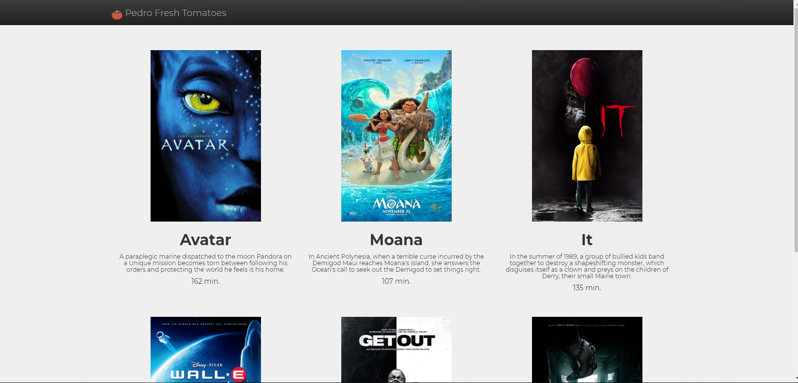

# movie_project

## Introduction
This is the first project of the series of projects related to **Udacity's Full Stack 
Web Developer Nanodegree Program.**  

<p align="center">
  
</p>

In this project, in the file *movies.py* I created some classes to use in the project. The classes: Video, Movie and Series. If you want to understande more about the classes you just need to access its docstrings.  

In the file *mindstorms.py* i just instanciated some objetcs of the Movie class to populate the HTML page generated at the end of the project.  

The file *fresh_tomatoes.py* was created by the Udacity Team and I just added some personalization to the file.

## Starting

How to run the program from the Terminal:
1. Clone the directory:
    ``` git clone https://github.com/pedrocecchetti/movie_project.git ```
2. Navigate to the repository :
    ```cd movie_project```
3. Run Python mindstorms:
    ```python mindstorms.py```